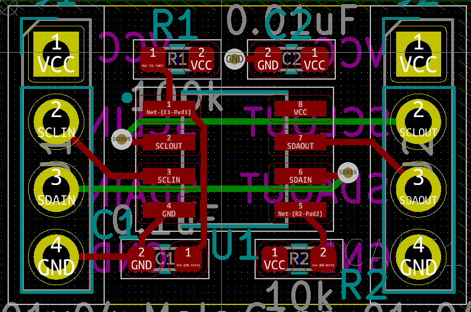

# Hotswap I2C breakout board

This board uses the TCA4311ADR by Texas Instruments. More information can be found in the data sheet.

## Wiring Example

```
       5V+ -> VCC                 VCC -> 5V+ 
Master SDA -> SDAIN  TCA4311A  SDAOUT -> Slave SDA
Master SCL -> SCLIN            SCLOUT -> Slave SCL
       GND -> GND                 GND -> GND
```

Pullup resistors are required on both sides on the I2C bus.


